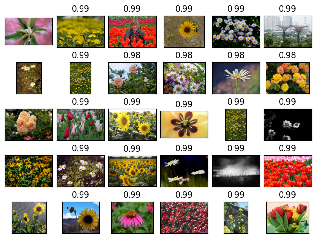

# Инструкция по запуску сервиса:

1) Склонируйте репозиторий
2) Откройте терминал в этой директории
3) Напишите *docker build -t flower_similars .*
4) Дождитесь окончания сборки образа
5) Напишите *docker run --gpus all -p 8000:8000 flower_similars*
6) Перейдите по [ссылке](http://localhost:8000/docs) 
7) Нажмите на **Try it out**
8) В поле **Request body** в **image_path** вставьте data/tulip/21046610012_8942d32007_n.jpg, 
чтобы получилось 
- "image_path": "data/tulip/21046610012_8942d32007_n.jpg"
9) Нажмите **Execute**
10) В поле **Response body** должен отобразиться JSON.

# Пример работы модели для 5 случайных изображений

